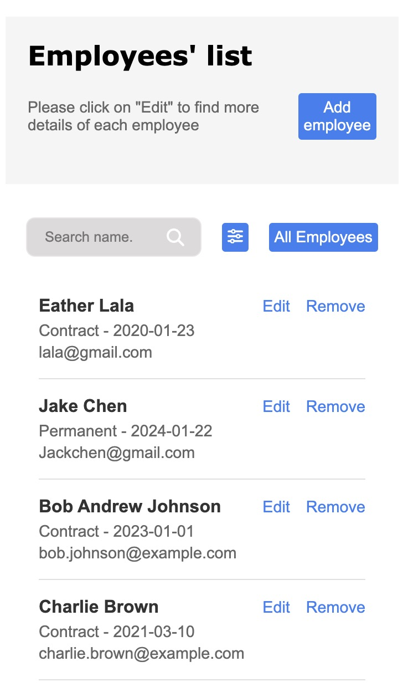
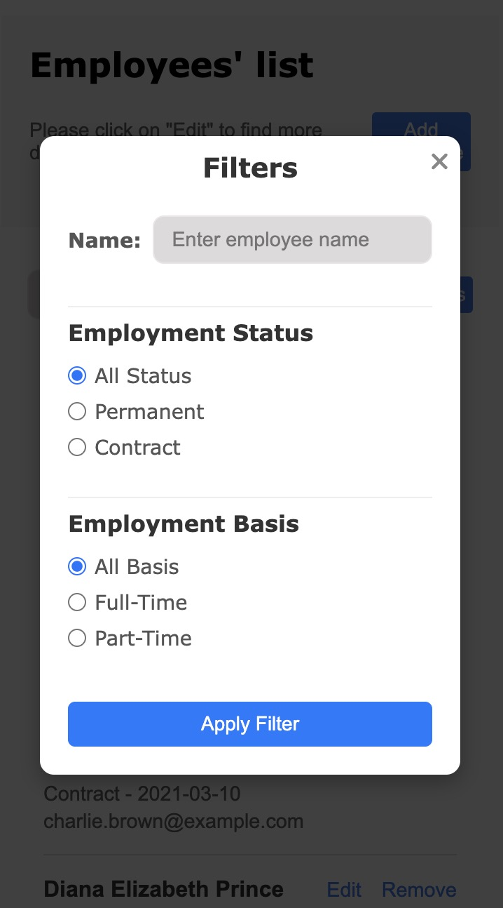
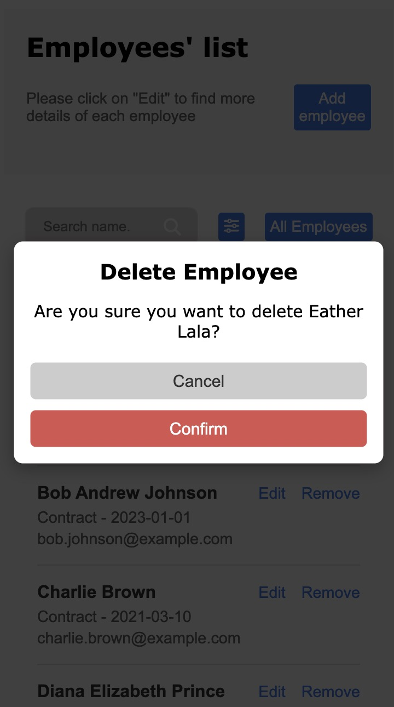

# Employee-Creator

## Description

The Employee-Creator project is a full-stack application designed to manage employee data effectively. Built with a modern tech stack, including React,Redux, TypeScript, and Java Spring, this application provides a user-friendly interface for performing CRUD operations on employee records. Users can easily create, read, update, and delete employee information, as well as search through records efficiently.

The project also emphasizes a robust validation system using react-hook-form and Zod, ensuring that user input is accurate and error-free. With a responsive design, the application offers a seamless experience across various devices, from desktops to mobile phones. Furthermore, the backend is deployed on cloud services like AWS and Azure, demonstrating the application’s adaptability and scalability in a cloud environment.

## Demo

---

## Table of Contents

- [Purpose](#purpose)
- [Design Goals](#design-goals)
- [Technologies Used](#Technologies-used)
- [Features](#features)
- [Challenges](#challenges)
- [Known Issues](#known-issues)
- [Future Goals](#future-goals)

---

## Purpose

The purpose of this project includes:

- **Learning Goal**: To practice and demonstrate capabilities in TypeScript, React, Redux and the Java Spring framework as a full-stack solution.
- **Functional**: To offer CRUD operations, search feature and a pop-up filters.
- **Unit Test**: Ensured backend and front end methods and functions run successfully through unit testing.
- **CI/CD**: Used GitHub to automate test execution.
- **Adaptive**: Ensuring a responsive layout that works across various devices and screen sizes.
- **Cloud technology**: Using AWS/Azure to deploy backend, frontend and connect to Azure SQL database.

---

## Design Goals

- **Frontend**: Build a dynamic and interactive website using TypeScript that provides a seamless user experience.
- **Backend**: Use MySQL to store and manage all product data, Java and Spring Framework
- **Responsive**: Ensure the website is fully responsive and works well across various screen sizes.

## Technologies Used

- **Frontend**: React.js, Redux, TypeScript, SCSS
- **Backend**: Java, Spring
- **Database**: MySQL
- **Unit Test**:com.h2database, mockito, vitest
- **Cloud technology**: AWS/Azure
- **Others**: React-Hook-Form

## Features

- **CRUD Operations**: Users can create, read, update, delete and search employees.
- **Alert Validation Messages on Forms**: Set validation by using react-hook-form with a Zod schema to define your validation rules. This allows you to provide clear and concise error messages to users when their input fails validation, improving the overall user experience and ensuring that form submissions meet the required criteria.
- **Responsive Design**: Fully responsive layout that adjusts to desktops, tablets, and mobile phones.

## 

## 

## 

## Challenges

- **Validation Messages on Forms**: Set validation by using react-hook-form with a Zod schema to define your validation rules. When onGoing is clicked, need to set finishdate can be nullable.
- **Deploy on Cloud**: After researching Azure, I connected my local database to Azure SQL Database and deployed the backend using Azure CLI commands to copy the JAR file from my GitHub repository. I also used GitHub CI/CD workflows on Azure for deploying the frontend.

---

## Future Goals

1. **Employee display**: Display employee's details by click the name.
2. **Unit Testing**: Add more Unit Testing.

---

## Conclusion

In conclusion, the Employee-Creator project serves as a comprehensive platform for managing employee data while showcasing the capabilities of modern web technologies. It not only fulfills its functional requirements but also addresses critical aspects of user experience, such as validation and responsiveness. The challenges faced during development, particularly in cloud deployment and form validation, have provided valuable learning experiences that will contribute to future projects.
